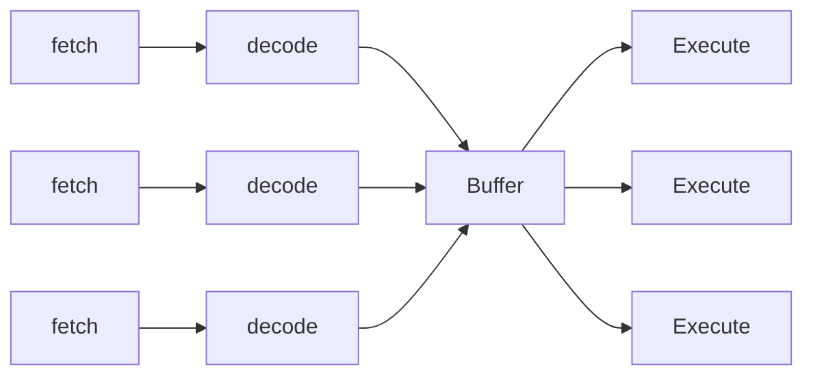

### pre-requisite reading

-   Sections 1.1 - 1.5 of Modern Operating Systems
-   Introduction and Chapter 1 of The C Programming Language

### Overview of modern computers

Most modern computers contain these basic essential parts:

-   Processors
-   Memory
-   Disks
-   I/O (devices that transfer from data to and from the computer)

-   software programs are applications that run on the hardware they do not need to
    have full knowledge of the hardware in order to run

-   this is because operating systems abstract any low level `1s` and `0s` of direct
    interaction with hardware and provide a nice layer that software can interact
    with
-   we can divide certain programs into two 'arenas' of execution: 'user space' and
    'kernel' space
-   programs like browsers, file explorer and spotify run in user space, while
    programs that manage things like your internet connection and battery
    optimization run in kernel space.
-   this is done so that the operating system maintains federation over what can
    access the hardware and when
-   if a program requires access to the hardware e.g. to draw to the screen, output
    to speakers or to print a document. it can request a promotion to kernel space

### CPUs

-   At a low level, programs that run on a computer contain a series of specific
    instructions that the CPU can interpret, called assembly. when executing a series
    of instructions the CPU will fetch, decode and execute, in that order. the
    instructions are stored in highly and fast available storage known as registers
-   these instructions can be executed in either `user` or `kernel` space.
-   in kernel space the CPU can execute the whole the instruction space while user
    space it is restricted to only that which does not access the hardware directly

-   in the history of CPU development, not too long ago CPU design looked somewhat
    like this

-   this allowed the seperate cycles of execution to be done simultaneously.

-   more modern CPUs will look something like this

-   in this configuration multiple instructions can be fetched, decoded independently
    and simultaneously, stored temporarily, the picked up by a free execution unit

-   CPUs for decades have been following a simple law, the number of transistors will
    double in an integrated, while cost stays similar. while this isn't a real
    scientific law. it is something that we observe to be true and has held true for
    a very long time. This is known as `moore's law`. and was first observed in 1965.

-   this is only starting to slow down know, as transistors are starting to reach the
    size where if we try to go any smaller, quantum effects start to appear

### memory

memory is made up of different layers and is located at various points on a computer

when can roughly seperate the catagories of memory into a couple segments

| Access Time     | Name         | Capacity                            | Location              |
| --------------- | ------------ | ----------------------------------- | --------------------- |
| 1 nanosecond    | registers    | less then a kilobyte                | CPU                   |
| 2 nanoseconds   | Cache        | 4mb                                 | CPU/Motherboard       |
| 10 nanoseconds  | Main Memory  | 1 - 32GBs                           | RAM                   |
| 10 milliseconds | Disk storage | 1 - however many terabytes you want | SATA/PCIE connections |

each segment of memory has its own specialty and use pros and cons

for caches we can even divide this into different types

-   L1 - inside the CPU very limited
-   L2 - shared across cores/per core allocation
